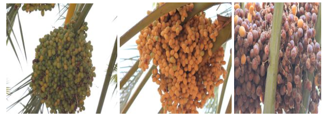

# giz-ai4agriculture
This repo contains some open source AI models as part of the project between GIZ and KaraAgro AI. Two AI models were developed - one for yield estimation in dates and the other for pest and disease detection in apple.

## Yield Estimation Model
This model is an image classfication model that predicts the maturity class of dates fruits. The training dataset feature three maturity classes: Immature, Tamar, and Kalal (Figure 1).

**Figure 1**: dates maturity classes. Immature, Tamar, and Kalal respectively

The perfomance of the model is shown in Figure 2 below. The model converged with a validation accuracy of 86.93%

## Disease & Pest Detection Model
This is classification model was trained to identify four classes in apple: apple scab, black rot, cedar apple rust, and healthy. The training performance of the model is shown in Figure 3: